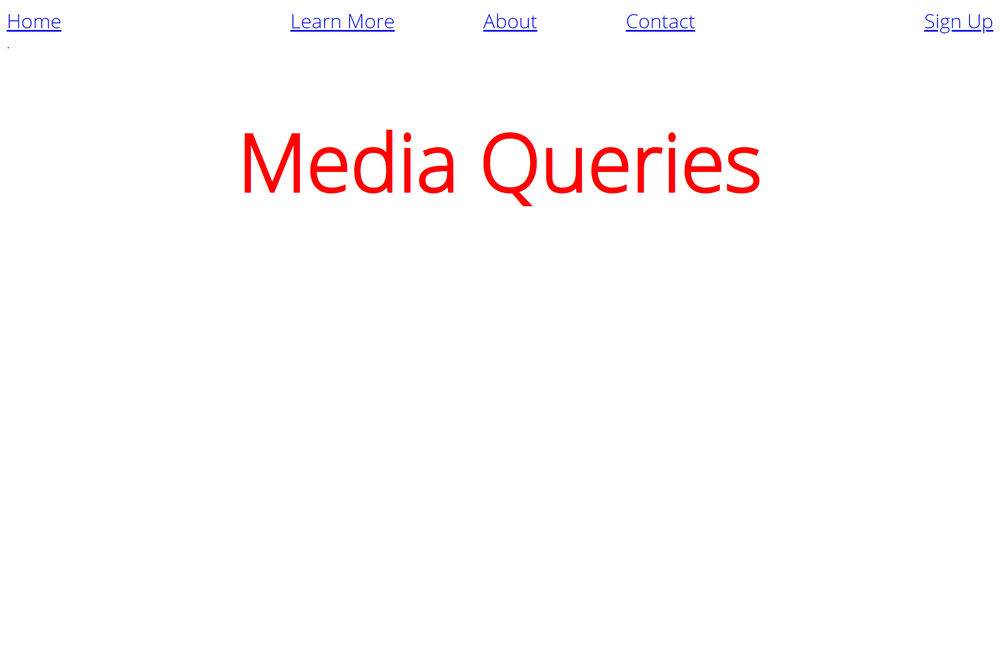

# Colt Steele - The Web Developer Bootcamp 2021

This repository is to track my progress as I work through [The Web Developer Bootcamp 2021](https://www.udemy.com/course/the-web-developer-bootcamp/) by Colt Steele on Udemy.com. I will be working on this course in conjunction with [The Complete 2021 Web Development Bootcamp](https://www.udemy.com/course/the-complete-web-development-bootcamp/) by Angela Yu, also on Udemy.

Start Date: December 2020

## Checklist

- [x] [Marathon Form](#marathon-form)
- [x] [Photo Site](#photo-site)
- [x] [Responsive Nav](#responsive-nav)
- [ ] Pricing Panel
- [ ] Museum of Candy
- [ ] Todo List
- [ ] Score Keeper
- [ ] TV Show Search App
- [ ] YelpCamp

## Completed Projects

### [Marathon Form](https://mmanogaran.github.io/web-dev-colt-steele/01-marathon-form/index.html)

A basic HTML only form.
#### Modifications
- Used `<fieldset>` to group different sections of the form

### [Photo Site](https://mmanogaran.github.io/web-dev-colt-steele/02-photo-site/index.html)

A HTML and CSS only site with photos in a 3x3 grid.
#### Modifications
- Used CSS Grid for layout instead of just `margin` and `padding`

### [Responsive Nav](https://mmanogaran.github.io/web-dev-colt-steele/03-responsive-nav/index.html)

| Mobile Screenshot                                   | Desktop Screenshot                                   |
| --------------------------------------------------- | ---------------------------------------------------- |
|  |  |

A responsive nav bar made using CSS Flexbox and a colour changing heading using media queries.

#### Modifications
- Made site mobile-first
- Tried out the technique in [this post](https://www.madebymike.com.au/writing/precise-control-responsive-typography/) to scale the font size of the heading while the viewport width is within a certain range
- Used SASS to more smoothly transition through colors at different screen widths