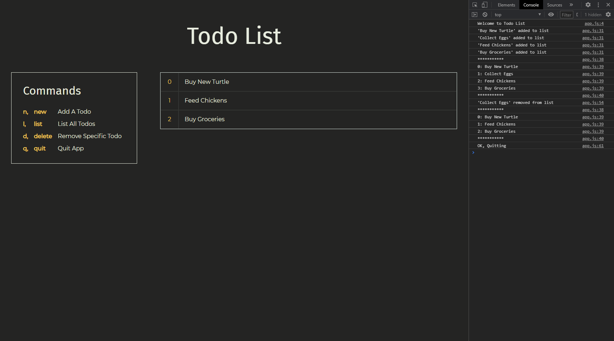

# Colt Steele - The Web Developer Bootcamp 2021

This repository is to track my progress as I work through [The Web Developer Bootcamp 2021](https://www.udemy.com/course/the-web-developer-bootcamp/) by Colt Steele on Udemy.com. I will be working on this course in conjunction with [The Complete 2021 Web Development Bootcamp](https://www.udemy.com/course/the-complete-web-development-bootcamp/) by Angela Yu, also on Udemy.

Start Date: December 2020

## Checklist

- [x] [Marathon Form](#marathon-form)
- [x] [Photo Site](#photo-site)
- [x] [Responsive Nav](#responsive-nav)
- [x] [Pricing Panel](#pricing-panel)
- [x] [Museum of Candy](#museum-of-candy)
- [x] [Todo List](#todo-list)
- [x] [Score Keeper](#score-keeper)
- [ ] TV Show Search App
- [ ] YelpCamp

## Completed Projects

### [Marathon Form](https://mmanogaran.github.io/web-dev-colt-steele/01-marathon-form/index.html)

A basic HTML only form.
#### Modifications
- Used `<fieldset>` to group different sections of the form

  

### [Photo Site](https://mmanogaran.github.io/web-dev-colt-steele/02-photo-site/index.html)

A HTML and CSS only site with photos in a 3x3 grid.
#### Modifications
- Used CSS Grid for layout instead of just `margin` and `padding`

  

### [Responsive Nav](https://mmanogaran.github.io/web-dev-colt-steele/03-responsive-nav/index.html)

A responsive nav bar made using CSS Flexbox and a colour changing heading using media queries.

#### Modifications
- Made site mobile-first
- Tried out the technique in [this post](https://www.madebymike.com.au/writing/precise-control-responsive-typography/) to scale the font size of the heading while the viewport width is within a certain range
- Used SASS to more smoothly transition through colors at different screen widths

  

### [Pricing Panel](https://mmanogaran.github.io/web-dev-colt-steele/04-pricing-panel/index.html)

A responsive pricing panel.

#### Modifications
- Converted to SASS to make things more organized
- Used CSS Flexbox more to handle layout

  

### [Museum of Candy](https://mmanogaran.github.io/web-dev-colt-steele/05-museum-of-candy/index.html)

A basic website made using Bootstrap.

  

### [Todo List](https://mmanogaran.github.io/web-dev-colt-steele/06-todo-list/index.html)

A console-based todo list.

#### Modifications
- Used `switch` instead of `if else` to differentiate commands
- Used `forEach` instead of `for` loop to list todos
- Used `setTimeout` to make sure page loads before `prompt` stalls everything
  - Already tried:
    - `window.onload = toDoApp`
    - `document.addEventListener("DOMContentLoaded", toDoApp)`
    - `window.addEventListener("load", toDoApp)`
  - Need to look more into it
- Added some styling
- Todo list is now displayed on the browser and adjusts according to user input
  - Works on Firefox, but not on Chrome

  

### [Score Keeper](https://mmanogaran.github.io/web-dev-colt-steele/07-score-keeper/index.html)

A simple ping pong score keeper.

  